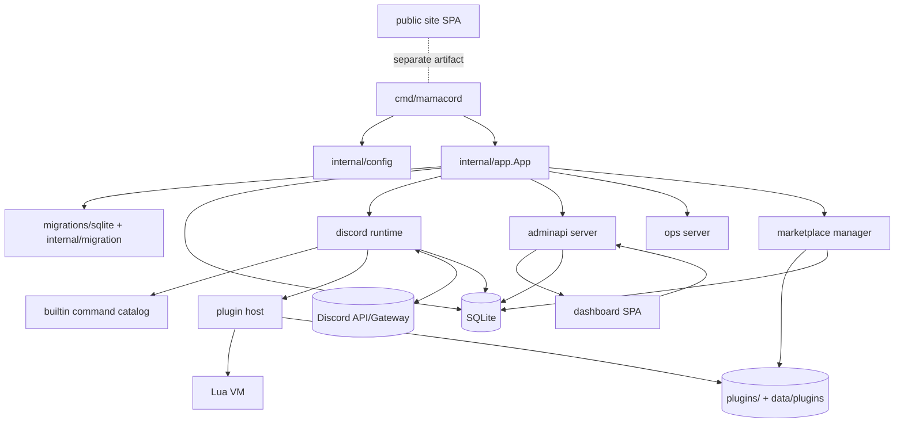
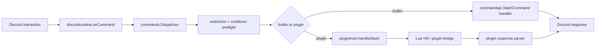
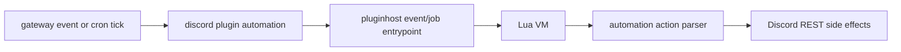
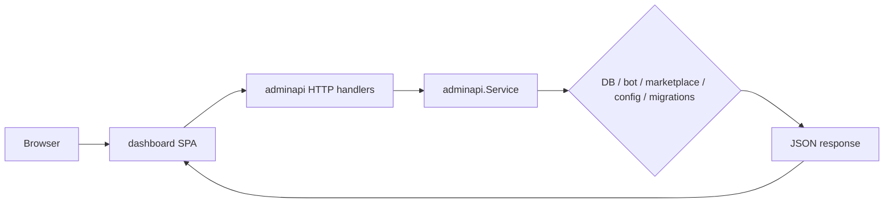
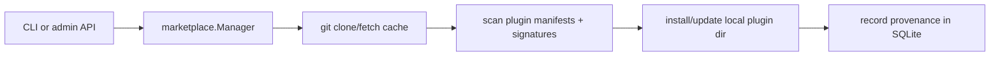
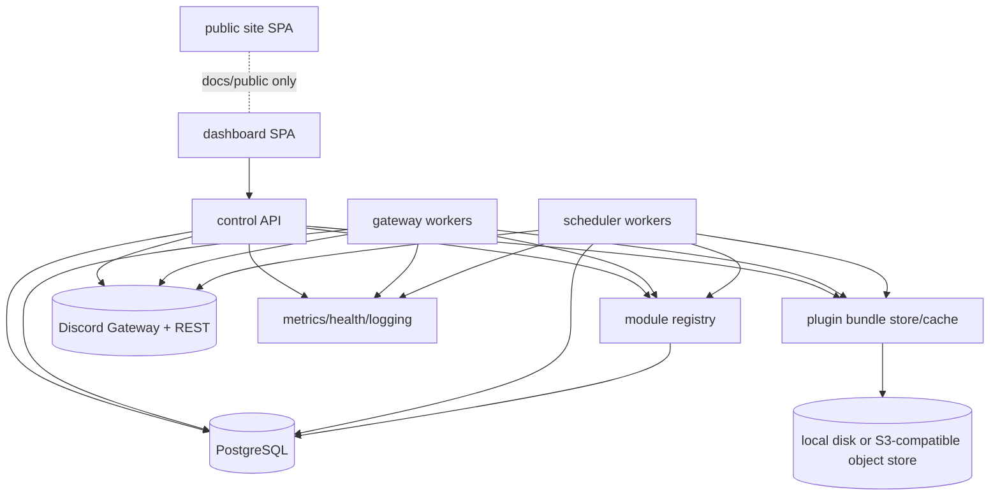
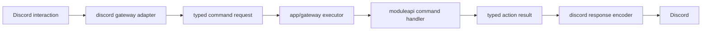
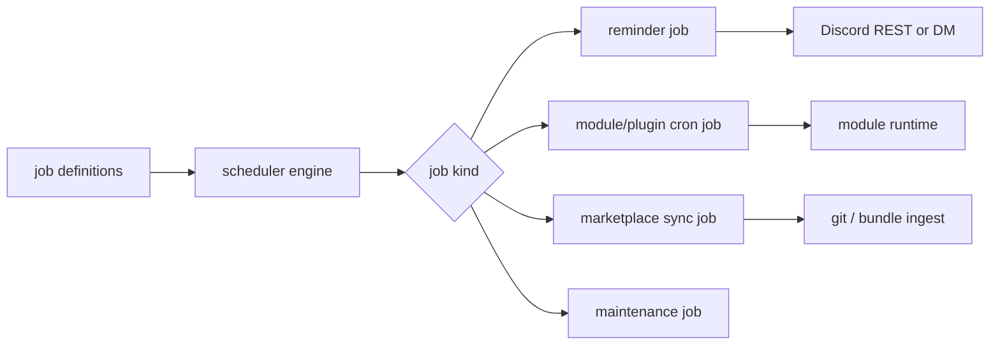
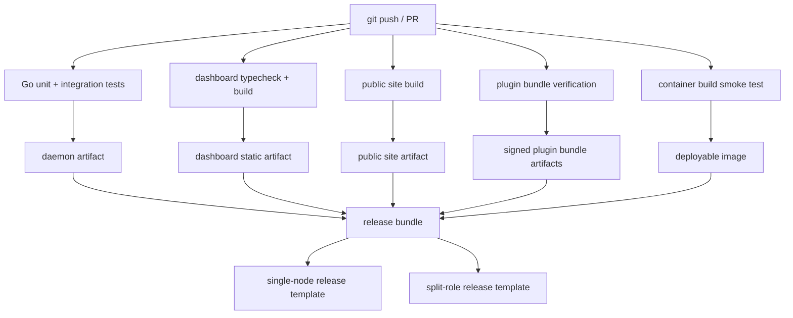

# Architecture audit — 2026-05-23

This is a repo-wide audit of the current `go-mamacord` architecture and runtime/build pipelines, followed by a proposed breaking redesign for:

- large Discord footprint / large admin surface area
- optional horizontal scale
- continued single-board-computer runnability
- zero legacy compatibility constraints

Related tree export: `docs/internal-tree-audit-2026-05-23.md`

---

## Scope checked

Primary repo evidence reviewed:

- boot / process wiring: `cmd/mamacord/main.go`, `internal/app/app.go`, `internal/config/config.go`
- Discord runtime: `internal/runtime/discord/{bot.go,client.go,lifecycle.go,command_runtime.go,gateway_events.go,plugin_runtime.go,services.go}`
- Discord command path: `internal/runtime/discord/commands/{application.go,registration.go,runtime.go}`, `internal/commands/{catalog.go,api/contracts.go}`
- plugin system: `internal/runtime/plugins/{host.go,manifest.go,runtime_descriptor.go}`, `internal/runtime/plugins/lua/vm.go`, `internal/runtime/discord/plugin/{automation.go,response.go,types.go}`
- admin/dashboard control plane: `internal/adminapi/{server.go,service.go}` and `apps/dashboard/src/{App.tsx,api.ts}`
- storage / migrations / ops: `internal/storage/{store.go,sqlite/store.go}`, `migrations/sqlite/*.sql`, `internal/ops/{server.go,metrics.go}`
- marketplace / release / deploy / web: `internal/marketplace/{manager.go,types.go}`, `Dockerfile`, `compose.yml`, `.github/workflows/{ci.yml,pages.yml}`, `apps/site/src/site.tsx`, `scripts/build-release.sh`

Runtime verification checked:

- `go test ./...` with local `GOCACHE`
  - fails in `internal/runtime/plugins` because tracked bundled plugin signatures no longer verify

---

## Current architecture, as implemented

### Current runtime topology



### Current ingress pipelines

#### 1. Startup / boot pipeline


#### 2. Discord slash-command pipeline



#### 3. Plugin automation pipeline



#### 4. Dashboard/admin pipeline



#### 5. Marketplace pipeline



---

## What is structurally good already

1. **The repo already wants a modular monolith.**
   - `internal/app` is a clear composition root.
   - `internal/runtime/discord`, `internal/adminapi`, `internal/marketplace`, `internal/storage`, `internal/ops` are recognizably separate concerns.

2. **SBC-first discipline is visible.**
   - SQLite, local files, static dashboard option, and single-process dev flow are all legitimate single-node choices.

3. **The plugin model is real, not fake.**
   - Manifest + signature + host permissions + Lua VM + automation hooks are all implemented, not hand-waved.

4. **Web is already split into public site vs admin dashboard.**
   - `apps/site`, `apps/dashboard`, and `packages/web-ui` show a sensible frontend split.

5. **The repo already records useful runtime state.**
   - guilds, users, guild_members, module states, reminders, marketplace provenance, admin sessions.

---

## Current architecture problems

## A. The runtime is one process, but not one clean boundary

`internal/app.App` wires everything well enough to run, but the subsystems are still tightly entangled:

- `initAdminServer` hard-requires the bot to be initialized first
- admin operations call directly into bot methods for guild reads and writes
- the dashboard control plane is therefore not truly independent from gateway/runtime state

**Consequence:** control-plane availability is coupled to bot/runtime composition, even though the repo already wants the dashboard/API to keep working when Discord startup fails.

---

## B. Command architecture is split across overlapping layers

Repo evidence:

- `internal/commands/...` = builtin command definitions
- `internal/runtime/discord/commands/...` = Discord command registration + dispatch runtime
- `internal/commands/api/contracts.go` = not just contracts; it imports Discord event types, interactions helpers, plugin host types, persona helpers, marketplace types, and storage interfaces

Import hotspot evidence:

- high inbound coupling into `internal/commands/api`
- high outbound coupling from `internal/runtime/discord` and `internal/runtime/discord/commands`

**Problem:** the command model is not transport-neutral and not runtime-neutral.

**Consequence:** adding or changing one command concern tends to touch definition code, Discord transport code, store umbrellas, localization helpers, and plugin/runtime glue together.

---

## C. The plugin stack is powerful but too mentally expensive

Current plugin stack is spread across:

- `internal/runtime/plugins` = host / loading / signing / registry
- `internal/runtime/plugins/lua` = Lua runtime + host SDK
- `internal/runtime/discord/plugin` = Discord-facing bridge / response parsing / automation execution

Hotspot evidence:

- `internal/runtime/plugins/host.go` = 1523 LOC
- `internal/runtime/plugins/lua/vm.go` = 1300 LOC
- `internal/runtime/discord/plugin/response.go` = 1087 LOC
- `internal/runtime/discord/plugin/discord_executor.go` = 925 LOC

**Problem:** the plugin boundary is not explicit enough. The repo has:

- raw `any` values crossing boundaries
- large duplicated Discord capability interfaces in both host and VM layers
- response parsing, transport constraints, automation parsing, and Lua execution split across several large files

**Consequence:** the plugin system works, but it is hard to reason about, hard to extend safely, and hard to scale out beyond one host with shared local filesystem assumptions.

---

## D. The admin API package is a control plane, an HTTP server, a migration console, a plugin scaffolder, and a marketplace console all at once

Evidence:

- `internal/adminapi/server.go` registers **54** handlers
- `internal/adminapi/server.go` = 1297 LOC
- `internal/adminapi/service.go` = 1517 LOC
- `Service` methods cover:
  - dashboard setup
  - Discord OAuth
  - guild dashboard reads
  - moderation and manager actions
  - module state
  - plugin reload/sign/scaffold
  - marketplace source/search/install/update/trust
  - permissions/modules config file editing
  - migrations status/up/backup

**Problem:** this is a monolithic control plane package with too many reasons to change.

**Consequence:** HTTP concerns, auth/session concerns, bot-control concerns, migration concerns, and plugin lifecycle concerns are forced into the same mental context.

---

## E. The storage shape is good for single-node, not for scale-out

Current storage is SQLite-backed for:

- command/domain state
- admin sessions
- reminder leasing
- marketplace metadata
- guild/user projections
- module states

**What is good:** this is fine for SBC and one-host deployments.

**What breaks at scale:**

- multi-writer coordination
- horizontal control-plane instances
- horizontally scaled schedulers/workers
- plugin bundle distribution via shared local dirs
- heavier query loads from dashboard/admin activity

**Consequence:** the current persistence model is a solid single-node foundation, but it is also the main scalability ceiling.

---

## F. Scheduling is duplicated

Current scheduled work exists in at least two independent paths:

- reminder poller with leasing: `internal/runtime/discord/automation/reminders.go`
- plugin cron automation: `internal/runtime/discord/plugin/automation.go`

**Problem:** there is no single job system.

**Consequence:** retries, leases, observability, backpressure, and future background work types will continue to diverge.

---

## G. Deployment boundaries are inconsistent

### G1. Docker/compose currently collapse bundled and mutable plugin directories

Repo evidence:

- `internal/config/config.go` defaults bundled plugins to `./plugins`
- user plugins default to `./data/plugins`, but can be overridden by `PLUGINS_DIR`
- `Dockerfile` sets `PLUGINS_DIR=/app/plugins`
- `compose.yml` mounts `./plugins:/app/plugins`

**Effect:** in containerized deployments, bundled plugins and user-installed plugins collapse onto the same path.

**Consequence:** immutable first-party assets and mutable marketplace/user assets are mixed together.

### G2. Docker build path appears malformed and is not CI-covered

Repo evidence:

- `Dockerfile` has:
  - `RUN BUILD_DESCRIPTION_BASE64=... && \`
  - followed immediately by another `RUN go build ...`
- `.github/workflows/ci.yml` does not build the Docker image

**Consequence:** the container pipeline is not treated as a first-class verified artifact.

### G3. Pages deploys only the public site

Repo evidence:

- `.github/workflows/pages.yml` deploys `apps/site/dist`
- there is no matching deploy pipeline for the dashboard artifact

**Consequence:** public-site delivery is clearer than dashboard delivery.

---

## H. The public site overstates implemented product shape

Repo evidence:

- `apps/site/src/site.tsx` advertises Twitch integration and WeatherKit-backed weather providers
- repo search only finds those claims in the site copy and test plugin names, not in implemented backend/runtime packages

**Consequence:** public architecture messaging is ahead of actual backend structure.

---

## I. Current test/build health is not green

Checked locally:

- `go test ./...` fails in `internal/runtime/plugins`
- failure reason: tracked bundled plugin signatures currently mismatch for `info`, `moderation`, `fun`, `wellness`, `manager`

**Consequence:** plugin signing integrity is already drifting from the checked-in artifacts.

---

## Proposed architecture: breaking redesign

## Design goal

One codebase, one domain model, one module system, one scheduler model.

Deploy it in two profiles:

1. **single-node profile** for SBCs and simple self-hosting
2. **split-role profile** for large Discord footprint / larger admin usage

No compatibility layer. No legacy package preservation. No alias-driven naming.

---

## Proposed principles

1. **Make the codebase a clean modular monolith first.**
   - Then split runtime roles by deployment, not by duplicated business logic.

2. **Use one module contract for both builtins and plugins.**
   - Builtins are Go modules.
   - Plugins are Lua-backed modules.
   - The runtime treats both through one interface.

3. **Move transport types to adapters.**
   - Discord event structs stop leaking into command/domain contracts.
   - HTTP handlers stop leaking into control-plane application services.

4. **Make storage domain-shaped, not system-shaped.**
   - Replace giant umbrella `Store` interfaces with small per-domain repositories.

5. **Unify background work.**
   - reminders, plugin cron jobs, sync jobs, maintenance tasks all use one scheduler/runtime.

6. **Treat plugin bundles as versioned artifacts, not just directories.**
   - local disk in SBC mode
   - object/blob store + local cache in scale mode

7. **Keep the deployable unit count optional.**
   - one daemon with roles enabled locally
   - split daemons for bigger installs

---

## Proposed package architecture

```text
cmd/
  mamacordd/          # long-running daemon; roles enabled by flags/config
  mamacordctl/        # admin CLI: migrate, sign, inspect, repair, sync

internal/
  boot/               # config load, wiring, role startup
  config/             # strict config, no compatibility env fallbacks
  observability/      # metrics, health, logging, tracing hooks

  domain/
    auth/
    guilds/
    users/
    modules/
    commands/
    plugins/
    marketplace/
    moderation/
    reminders/
    scheduling/
    audit/

  app/
    gateway/          # use-cases for Discord ingress
    control/          # use-cases for dashboard/admin control plane
    scheduler/        # background job engine use-cases
    catalog/          # module + command catalog assembly

  adapters/
    discord/
      gateway/
      rest/
      commandcodec/
    http/
      adminapi/
    storage/
      sqlite/
      postgres/
    plugins/
      lua/
      bundles/
    marketplace/
      git/
    web/
      dashboardstatic/

  moduleapi/          # single module contract for Go modules and Lua modules
```

### What disappears

- `internal/commands/api` as a catch-all umbrella
- `internal/runtime/discord/commands` as a second `commands` tree
- `internal/runtime/discord/plugin` as a vaguely named bridge bucket
- giant umbrella `Store` interfaces passed everywhere
- `pluginhost`/`discordruntime`/`commandapi` alias-heavy naming style

---

## Proposed runtime topology

### Scale profile



### Single-node / SBC profile

```mermaid
flowchart TD
    U[Discord + browser users] --> D[mamacordd]
    D --> DB[(SQLite)]
    D --> PLUG[(local plugin bundle cache)]
    D --> DISCORD[(Discord API/Gateway)]
    D --> DASH[(optional embedded or sidecar dashboard static build)]
    D --> OPS[/healthz /readyz /metrics]

    subgraph mamacordd roles
      CP[control API role]
      GR[gateway role]
      SR[scheduler role]
      MR[module registry role]
    end

    CP --> MR
    GR --> MR
    SR --> MR
```

**Why this works:**

- same domain/use-case code in both profiles
- only adapters and role composition change
- SBC stays one process with SQLite + local disk
- large installs switch DB/backend/storage and split role counts without rewriting the business logic

---

## Proposed module system

Unify builtins and plugins behind one contract:

```go
package moduleapi

type Module interface {
    Descriptor() Descriptor
    Commands() []Command
    EventHandlers() []EventHandler
    Jobs() []Job
}
```

### Builtins

- Go packages implement `moduleapi.Module`
- no special builtin command path

### Lua plugins

- Lua adapter loads a signed bundle
- adapter converts plugin manifest + script exports into `moduleapi.Module`
- typed decode happens inside the Lua adapter only

### Why this matters

Current repo says “builtins and plugins are modules”, but the runtime still treats them through separate pipelines. The proposal makes that statement actually true.

---

## Proposed Discord ingress model

### Current pain

- command definitions, dispatch, restrictions, and response translation are split across overlapping packages
- plugin path returns raw `any`
- admin reads depend on live bot state too directly

### Proposal

- `adapters/discord/commandcodec` converts Discord interactions into typed app-layer requests
- `app/gateway` resolves module + command and executes a typed handler
- typed action/result structs come back
- adapter encodes them into Discord responses



**Result:** Discord types stop leaking upward; plugin raw-table handling stops leaking outward.

---

## Proposed control-plane model

The control plane becomes a pure application/API layer, not a bot appendage.

### Responsibilities

- Discord OAuth + sessions
- dashboard/admin APIs
- module/plugin enablement
- marketplace source management
- plugin bundle publish/install/rollback
- migration/admin ops
- read models for guilds, plugins, modules, jobs

### Key breaking change

**The control API no longer depends on an already-initialized bot runtime.**

Instead it uses:

- DB-backed projections for read models
- Discord REST adapter for live writes/read-throughs when needed
- module registry state in DB

This removes the `initAdminServer requires bot` coupling present now.

---

## Proposed storage model

### Single-node

- SQLite remains supported
- WAL mode + sane busy timeouts
- local disk plugin bundles

### Scale profile

- PostgreSQL becomes the primary multi-instance backend
- object store or shared blob store for plugin bundles
- local ephemeral caches on each worker

### Domain repositories

Replace umbrella stores like this:

- `guilds.Repository`
- `users.Repository`
- `modules.Repository`
- `plugins.Repository`
- `bundles.Repository`
- `jobs.Repository`
- `sessions.Repository`
- `marketplace.Repository`

**Why:** this removes the need for broad `commandapi.Store`, `pluginhost.Store`, `luaplugin.Store` interfaces that currently drag unrelated dependencies everywhere.

---

## Proposed plugin bundle model

### Current

- plugin runtime loads mutable directories directly
- bundled and user plugins are sometimes path-collapsed by container config
- signatures are tracked per directory state

### Proposed

Treat every plugin version as an immutable signed bundle:

- manifest
- code
- locales
- optional assets
- signature
- content hash

### Lifecycle

1. publish or install bundle
2. store metadata in DB
3. store bundle on disk/object store
4. registry points module ID to active bundle revision
5. workers materialize bundle to local cache and hot-swap by generation number

**Benefits:**

- scalable distribution
- rollbackable deployments
- cleaner signature model
- no mutable shared plugin tree assumptions

---

## Proposed scheduler model

Unify all background work under one job engine.

### Jobs covered

- reminders
- plugin cron jobs
- marketplace source syncs
- command reconciliation tasks
- future maintenance jobs

### Execution model

- DB-backed job definitions + next-run timestamps + leases
- one runner in SBC mode
- multiple leased workers in scale mode



This removes the current split between the reminder poller and the plugin cron automation path.

---

## Proposed build / release / deploy pipeline

### Current issues

- Go tests currently fail on plugin signatures
- no Docker image build in CI
- no dashboard/API contract tests
- no deployment artifact story tying daemon + dashboard + site + plugin bundles together

### Proposed pipeline



### Required checks in the new pipeline

1. Go tests
2. plugin signature verification/regeneration check
3. dashboard build + API client contract generation/validation
4. Docker image build
5. single-node smoke boot
6. split-role smoke boot

---

## Concrete breaking changes I would make first

### Phase 1 — rename and redraw boundaries

1. replace alias-heavy packages with directory-aligned names
2. delete `internal/commands/api` umbrella
3. create `moduleapi`
4. split `internal/adminapi` into:
   - HTTP adapter
   - control application services
   - auth/session service
5. split `internal/runtime/plugins` into:
   - registry
   - bundle loader
   - signer/verification
   - lua adapter

### Phase 2 — make control plane independent

1. remove `admin server requires bot initialized first`
2. give control plane its own Discord REST adapter
3. move guild/dashboard reads toward DB projections + bounded read-through
4. make dashboard a pure static app + JSON API consumer

### Phase 3 — unify module execution

1. builtin modules implement `moduleapi.Module`
2. Lua plugins adapt into the same contract
3. replace raw `any` plugin result flow with typed results at adapter boundary
4. replace dual command trees with one module catalog and one ingress adapter

### Phase 4 — unify background work

1. one scheduler engine
2. migrate reminders into it
3. migrate plugin cron jobs into it
4. add reconciliation workers for command sync / bundle rollout

### Phase 5 — scale profile

1. add Postgres adapter
2. add bundle object store adapter
3. split roles in `mamacordd`
4. add optional dedicated binaries only if operationally useful

---

## Final call

## What the repo is today

A capable but increasingly tangled **single-process modular monolith** with:

- a real plugin system
- a real admin dashboard
- real marketplace and signing ideas
- solid SBC instincts
- blurred runtime boundaries
- oversized control-plane and plugin-runtime files
- a storage and filesystem model that stops short of scale-out

## What it should become

A **clean modular monolith with split-role deployment**, where:

- the control plane is independent
- the gateway runtime is shardable
- the scheduler is unified
- modules are truly one abstraction
- plugin bundles are immutable signed artifacts
- SQLite remains a first-class single-node option
- Postgres + object storage enable larger deployments

That is the architecture shape that best matches both of your constraints:

- **massive server/userbase ceiling**
- **SBC runnability floor**

